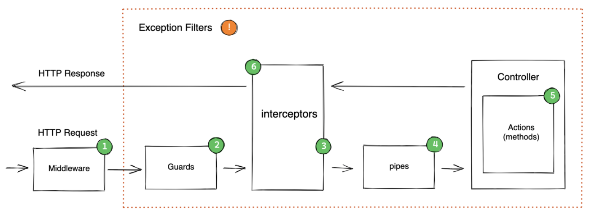

# nestjs-base-code

## 개요

이 프로젝트는 NestJS 프레임워크를 사용하여 인증 및 인가, 유저 관리 기능을 포함하는 기본적인 코드 베이스를 제공합니다.  
목적은 모든 프로젝트에서 공통적으로 사용할 수 있는 안전하고 확장 가능한 인증 및 인가
시스템을 구축하는 것입니다.

## 주요 기능

- **JWT 기반 인증**: 사용자 인증을 위해 JWT(Json Web Tokens)를 사용합니다.
- **역할 기반 인가**: 사용자 역할을 확인하여 특정 API 엔드포인트에 대한 접근을 제어합니다.
- **유저 관리**: 유저 생성, 조회, 업데이트 및 삭제 기능을 제공합니다.
- **메모 관리**: 유저별 메모 생성 및 관리 기능을 포함합니다.

## 기술 스택

- **NestJS**: 백엔드 애플리케이션 프레임워크
- **TypeORM**: 데이터베이스 관리
- **Passport**: 인증 미들웨어
- **JWT**: JSON Web Tokens을 사용한 인증
- **TypeScript**: 정적 타입 지원을 제공하는 JavaScript의 슈퍼셋

## 설치 및 실행

```bash
# 의존성 설치
npm install

# 서버 실행(dev)
npm run start:dev

# 서버 실행(prod)
npm run build
npm run start:prod
```

## NestJS LifeCycle



## TODO

- [x] jwt에서 userId 가져오는 Decorator 작성
- [x] 공통 ApiResponse json response 주도록 코드 작성
- [x] jwt Guard 작성 (기본, Admin용)
- [x] 페이징 처리
- [x] 각 에러별 custom 에러 코드 작성
- [ ] 소셜 로그인(카카오)
- [ ] 소셜 로그인(구글)